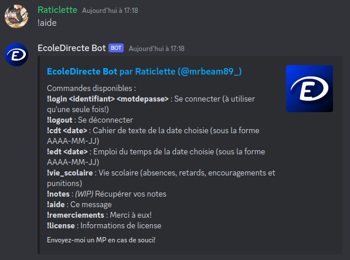

    

<h1 align="center">EcoleDirecte Bot</h1>

    
     
     
    
    
    
    
    
     
    

    <a href="#presentation">Présentation</a>
    ·
    <a href="#guide_demarrage">Guide de démarrage</a>
    ·
    <a href="#contribuer">Contribuer</a>
    ·
    <a href="#remerciements">Remerciements</a>
    ·
    <a href="#license">License</a>

<h2 id="presentation">Présentation</h2>

Un bot pour intégrer **EcoleDirecte** dans **Discord** avec [discord.py](https://github.com/Rapptz/discord.py)

Possède plusieurs fonctionnalités telles que :

- **Stockage des informations d'identification** : Utilise SQLite et AES-256 pour stocker vos identifiants chiffrés
- **Journalisation** : Gardez une trace des actions effectuées par le bot ainsi que celles des utilisateurs
- **Fichier de configuration** : Permet de changer les noms des fichiers, changer le préfixe des commandes, le niveau de journalisation et le cooldown entre les commandes
- **Cahier de texte** : Obtenir les devoirs du jour sélectionné
- **Emploi du temps** : Obtenir les cours du jour sélectionné
- **Vie scolaire** : Voir vos absences, retards, punitions et encouragements
- **Notes** *(WIP)* : Récupérer vos notes 

<h2 id="guide_demarrage">Guide de démarrage</h2>

### Prérequis

Vous aurez besoin des outils suivants :

- Python 3 : Disponible [ici](https://www.python.org/)
- `git` : Disponible [ici](https://git-scm.com/downloads) (optionnel)
- Module `discord` : `pip3 install discord.py`
- Module `cryptography` : `pip3 install cryptography`
- Module `requests` : `pip3 install requests`
- Module `yaml` : `pip3 install pyyaml`

### Installation

1. Clonez ce dépôt avec `git clone https://github.com/MrBeam89/ecoledirecte-bot.git` ou téléchargez le ZIP.
2. Allez dans le portail développeur de Discord [ici](https://discord.com/developers/applications) et connectez-vous si nécessaire.
3. Cliquez sur "New Application" en haut à droite de la page. [Image](docs/etape_3.png)
4. Utilisez le nom que vous voulez. [Image](docs/etape_4.png)
5. Cliquez sur "Bot", puis sur "Reset Token", puis sur "Yes, do it!". [Image](docs/etape_5.png)
6. Copier votre token et enregistrez-le dans un fichier nommé `token.txt` situé dans le dépôt cloné. **NE LE PARTAGEZ SURTOUT PAS**. [Image](docs/etape_6.png)
7. Activez toutes les "Privileged Gateway Intents" puis sauvegardez vos changements en cliquant sur "Save Changes". [Image](docs/etape_7.png)
8. Cliquez sur "OAuth2", puis sur "URL Generator", dans la section "SCOPES", sélectionnez "bot", puis "Administrator" dans la section "BOT PERMISSIONS" et copiez le lien en bas de page. [Image](docs/etape_8.png)
9. Suivez ce lien, sélectionnez votre serveur et cliquez sur "Continue" puis sur "Authorize". Vérifiez le Captcha. [Image](docs/etape_9.png)
10. Le bot est prêt!

### Démarrage

- Sur **Windows** : Double-cliquez le fichier `main.py`
- Sur **Linux/Mac** : Démarrez le terminal, accédez au répertoire du dépôt et tapez `python3 main.py`

Sur Discord, tapez la commande `!aide`, si tout est bien configuré, le bot devrait répondre avec ceci :

**:tada: Félicitations :tada: ! Le bot est prêt à être utilisé !**

### Fichier de configuration

Vous pouvez changer facilement les paramètres du bot en modifiant le fichier `config.yaml`.

**⚠️ AVERTISSEMENT ⚠️ : Si vous contribuez, il est recommandé de garder les extensions de fichier par défaut dans le fichier de configuration pour éviter tout upload de fichiers sensibles.**

<h2 id="contribuer">Contribuer</h2>

Bien que les fonctionnalités ont chacune une priorité, vous pouvez quand même ajouter celles avec une priorité plus basse malgré d'autres qui ont une priorité plus importante.

Pour celles qui n'ont pas été encore implémentées dans `ecoledirecte.py`, veuillez utiliser la documentation de l'API située [ici](https://github.com/EduWireApps/ecoledirecte-api-docs). 

**Priorité : Haute**

- [X] Connexion
- [X] Cahier de texte
- [X] Emploi du temps
- [X] Notes (WIP)
- [X] Vie scolaire
- [X] Fichier de configuration

**Priorité : Moyenne**

- [ ] Timeline commune
- [ ] Timeline
- [ ] Documents administratifs
- [ ] Leaderboard des notes
- [ ] MP lors d'une nouvelle note/nouveaux devoirs/observations

**Priorité : Basse**

- [ ] QCMs
- [ ] Manuels numériques
- [ ] Vie de la classe
- [ ] Formulaires
- [ ] Espaces de travail (non-implémentée)
- [ ] Cloud (non-implémentée)
- [ ] Téléchargement (non-implémentée)
- [ ] Messagerie (non-implémentée)

<h2 id="remerciements">Remerciements</h2>

- **L'équipe derrière la [documentation de l'API](https://github.com/EduWireApps/ecoledirecte-api-docs)** : Le bot n'aurait jamais vu le jour sans eux !
- **@BinaryBytecode** : Aide et conseils
- **Aleocraft** : Testeur (pas sur GitHub)
- **Vous 🫵** : Si vous contribuez, ou si vous utilisez ce bot !

Merci à eux !

<h2 id="license">License</h2>

Ce bot est distribué sous la **Licence Publique Générale GNU version 3.0 (GPLv3)**. Vous êtes libre d'utiliser, de modifier et de distribuer ce bot conformément aux termes de cette licence.
